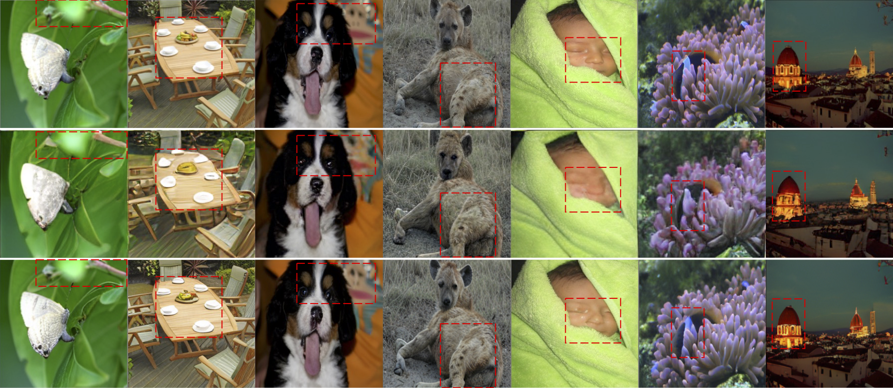
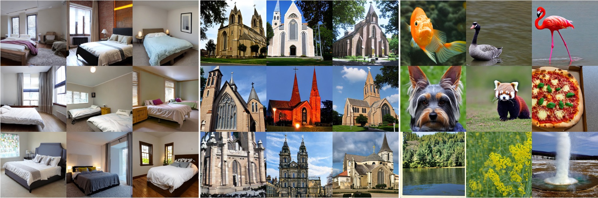

# CVQ-VAE

[paper]() | [arXiv](https://arxiv.org/abs/2307.15139) | [Project](https://chuanxiaz.com/cvq/) | [Video]()

This repository implements the training, testing and evaluation code for the "Online Clustered Codebook" by [Chuanxia Zheng](https://www.chuanxiaz.com) and [Andrea Vedaldi](https://www.robots.ox.ac.uk/~vedaldi/index.html). Given a high-dimensional images, our **CVQ-VAE** aims to quantise it into a discrete space with limited number of codebook entries. Unlike exisiting works that utilze only few entries, our **CVQ-VAE** can avoid codebook collapse and significantly enhance the usage (100% codebook utilisation) of larger codebooks by enabling optimisation all codevectors.

## Examples

- Reconstruction (Top: original input; Middle: Baseline VQGAN; Bottom: Ours CVQ-VAE)


- Generation (Left: LSUN-Bedrooms; Middle: LSUN-Churches; Right: ImageNet)



## Getting starrted
- Clone this repos:
```
git clone link
cd cvq-vae
```

## Requirements
The original model is trained and evaluated with Pytorch 1.13.1. We fixed all random seeds. The users should be able to achieve the same performance as the quantitative and qualitative results reported in the paper.

A suitable [conda](https://conda.io/) environment named `cvq-vae` can be created and activated with:

```
conda env create -f environment.yaml
conda activate cvq-vae
```

## Model Training

Training can be started by running:
```
CUDA_VISIBLE_DEVICES=<GPU_ID> python main.py \
--data_folder <data_path>/mnist \
--dataset mnist \
--output_folder <output_path> \
--exp_name mnist_cos_closest \
--batch_size 1024 \
--device cuda \
--num_epochs 500 \
--num_embedding 512 \
--embedding_dim 64 \
--distance cos \
--anchor closest 
```

For ablation study optional arguments:
```
--num_embedding 
                    number of codebook [32, 64, 128, 256, 512, 1024] for table 4(a)
--embedding_dim
                    dimensionality of codebook [4, 8, 16, 32, 64, 128] for table 4(b)
--anchor
                    anchor sampling methods ['closest', 'random', 'probrandom'] for table 4(c)
--first_batch
                    if true, offline version with only one-time reinitialisation for table 3
--contras_loss
                    if true, use contrastive loss for table 3
```

## Model Testing with codebook analysis

```
CUDA_VISIBLE_DEVICES=<GPU_ID> python test.py \
--data_folder <data_path>/mnist \
--dataset mnist \
--output_folder <output_path> \
--model_name mnist_cos_closest/best.pt \
--batch_size 16 \
--device cuda \
--num_embedding 512 \
--embedding_dim 64 \
--distance cos 
```
For ablation study, the users just need to modify the corresponding optional arguments as in training

The default results will be stored under the ```<output_folder>/results/<model_name>``` folder, in which:
- ```original/```: shows original images
- ```rec/```: shows reconstruction images

## Model Evaluation

```
CUDA_VISIBLE_DEVICES=<GPU_ID> python evaluation.py \
--gt_path <output_folder>/results/<model_name>/original/ \
-g_path <output_folder>/results/<model_name>/rec
```

## Model Application
The users just need to replace the quansiser in [VQGAN](https://github.com/CompVis/taming-transformers) for ffhq and imagenet reconstruction and [LDM](https://github.com/CompVis/latent-diffusion) for lsun generation.

## Next
- codebook learning for 3D reconstruction and generation

## License
This work is licensed under a MIT License.

This software is for educational and academic research purposes only. If you wish to obtain a commercial royalty bearing license to this software, please contact us at cxzheng@robots.ox.ac.uk

## Citation

If you use this code for your research, please cite our papers.
```
@InProceedings{Zheng_2023_CVQ,
    author    = {Zheng, Chuanxia and Vedaldi, Andrea},
    title     = {Online Clustered Codebook},
    booktitle = {Proceedings of International Conference on Computer Vision (ICCV)},
    month     = {October},
    year      = {2023},
}
```
